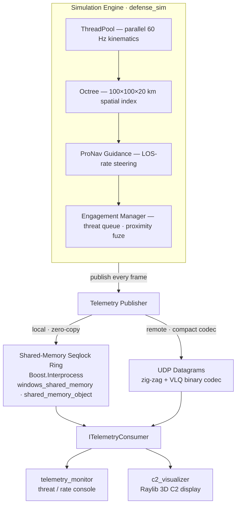

# Real-Time Defense Simulation & Telemetry Suite

A production-grade C++17 systems project modeling airspace threat tracking and
interception. Built to demonstrate the low-level engineering that defense
programs care about: cache-friendly data layout, hand-written spatial math,
lock-free-style parallelism, and rigorous unit testing.

> **Status:** All four phases complete — core engine + spatial math,
> closed-loop ProNav guidance with automated engagement, a Linux IPC telemetry
> pipeline (POSIX shared memory + UDP), and a decoupled Raylib 3D C2 visualizer
> that consumes either transport through one abstraction. See [`Plan.md`](Plan.md).

---

## Architecture

The simulation runs as one process and streams state to separate, read-only
display processes — so rendering and monitoring add zero overhead to the engine
loop. Consumers depend only on a transport-agnostic interface, so the same
binaries work over local shared memory or a remote UDP link.



Everything above builds and runs on both **Windows (MSVC)** and **Linux**.

---

## Phase 1 — Core Engine & Spatial Math

| Deliverable | Where |
|---|---|
| 3D vector math (dot, cross, magnitude, normalize, scale) | [`include/sim/Vector3.hpp`](include/sim/Vector3.hpp) |
| Entity model (id, position, velocity, type, status) + kinematics | [`include/sim/Entity.hpp`](include/sim/Entity.hpp) |
| Axis-aligned bounding box (containment, intersection) | [`include/sim/BoundingBox.hpp`](include/sim/BoundingBox.hpp) |
| Recursive 3D octree with filtered range queries | [`include/sim/Octree.hpp`](include/sim/Octree.hpp) · [`src/Octree.cpp`](src/Octree.cpp) |
| Reusable worker-thread pool (`parallelFor`) | [`include/sim/ThreadPool.hpp`](include/sim/ThreadPool.hpp) |
| Simulation engine: parallel update + spatial rebuild | [`include/sim/SimulationEngine.hpp`](include/sim/SimulationEngine.hpp) · [`src/SimulationEngine.cpp`](src/SimulationEngine.cpp) |
| GoogleTest suite (26 tests) | [`tests/`](tests) |

### Design highlights

- **Cache-friendly entities.** `Entity` is a standard-layout, trivially
  copyable aggregate so 10k+ tracks live in a flat contiguous array and can be
  `memcpy`'d straight into the Phase 3 telemetry pipeline.
- **Octree that stays correct under stress.** Nodes subdivide only when they
  exceed capacity and are below a depth cap; coincident points that cannot be
  separated by further subdivision are absorbed rather than dropped or looped
  on. Half-open box bounds keep every point in exactly one octant.
- **Query correctness is proven, not asserted.** `test_octree.cpp` validates
  200 randomized range queries across every allegiance filter against a brute
  force O(n) reference over 5,000 points.
- **Parallelism without locks on the hot path.** The per-frame kinematic update
  partitions the entity array into disjoint chunks across a persistent thread
  pool, so worker threads never touch overlapping memory — no mutex on the
  update itself. The pool reuses a single completion primitive per batch to
  stay portable across pthread implementations.

### Performance (20-thread machine, Release)

| Entities | Per-frame (integrate + octree rebuild) | 60 Hz headroom |
|---|---|---|
| 10,000 | ~1.8 ms | ~9x |
| 50,000 | ~5.6 ms | ~3x |

The 60 Hz frame budget is 16.7 ms; Phase 1 clears it with room to spare.

---

## Phase 2 — ProNav Guidance & Intercept

| Deliverable | Where |
|---|---|
| Proportional Navigation guidance law + LOS-rate / closing-speed / time-to-go math | [`include/sim/Guidance.hpp`](include/sim/Guidance.hpp) |
| Automated engagement manager: threat priority queue, target assignment, proximity fuze | [`include/sim/EngagementManager.hpp`](include/sim/EngagementManager.hpp) · [`src/EngagementManager.cpp`](src/EngagementManager.cpp) |
| ProNav convergence + engagement GTest suites (13 tests) | [`tests/test_guidance.cpp`](tests/test_guidance.cpp) · [`tests/test_engagement.cpp`](tests/test_engagement.cpp) |

### Design highlights

- **True Proportional Navigation.** `a_c = N·(V_r × Ω)` with
  `Ω = (R × V_r)/(R·R)`. The command vanishes on a collision course (zero LOS
  rate) and otherwise nulls the LOS rotation, driving intercept. Convergence is
  proven in closed-loop tests against crossing, inbound-3D, and sinusoidally-
  weaving maneuvering targets for N ∈ {3,4,5}.
- **Airframe limits (momentum).** The ProNav command is not applied raw: it is
  capped at the airframe's lateral G-limit (`applyAirframeLimits()`), and speed
  is drawn toward cruise only as fast as finite thrust/drag allow. So an
  interceptor *arcs* through a turn and bleeds/gains speed over time instead of
  pivoting like a UFO — real weight and inertia. Threats pitch over onto target
  under the same rate limit. Below a working airspeed a round flies pure pursuit
  to build speed before ProNav lead guidance takes over.
- **Threat prioritization.** Hostiles are ranked by time-to-impact against the
  defended asset (proximity breaks ties). Targeting queries go through the
  octree with the `QUERY_ENGAGEABLE_THREATS` mask (an allegiance matrix rather
  than a hard-coded filter), so any defender — friendly **or** allied-neutral —
  can prosecute the hostile set while never targeting one another; interceptors
  are assigned distinct threats.
- **Swept octree proximity fuze.** Each frame a fuze-box around every
  interceptor (enlarged by the worst-case per-frame closing travel) is queried
  for hostiles, then confirmed by the closest approach of the two motion
  segments over the step — not just the frame-boundary distance. At Mach-3+
  closing speeds (~30 m per 60 Hz frame) a point test tunnels straight through
  the target; the swept test catches the fly-through and detonates both bodies.

The demo's 12-vs-12 salvo (Mach-3 interceptors, Mach-1 inbound threats)
neutralizes all 12 threats, resolving in ~46 s of simulated time.

---

## Phase 3 — Linux IPC Telemetry

> **Cross-platform.** The shared-memory channel uses **Boost.Interprocess**
> (POSIX shm on Unix, a native file mapping on Windows), so the publisher,
> monitor, and `--source shm` visualizer run natively on Windows and Linux
> alike. Developed/tested on a Raspberry Pi 4 (aarch64, Debian 12) and Windows
> (MSVC). Boost is header-only here — from `libboost-dev` (apt) or vcpkg.

| Deliverable | Where |
|---|---|
| Byte-packed binary packet protocol (record + frame header) | [`include/sim/Telemetry.hpp`](include/sim/Telemetry.hpp) |
| Shared-memory seqlock ring buffer, zero-alloc/lock-free (Boost.Interprocess) | [`include/sim/SharedMemoryChannel.hpp`](include/sim/SharedMemoryChannel.hpp) · [`src/SharedMemoryChannel.cpp`](src/SharedMemoryChannel.cpp) |
| UDP sender/receiver (remote transport fallback) | [`include/sim/UdpTelemetry.hpp`](include/sim/UdpTelemetry.hpp) · [`src/UdpTelemetry.cpp`](src/UdpTelemetry.cpp) |
| Secondary monitoring executable | [`src/telemetry_monitor.cpp`](src/telemetry_monitor.cpp) |
| IPC GTest suite (round-trip, seqlock stress, UDP) | [`tests/test_telemetry.cpp`](tests/test_telemetry.cpp) |

### Design highlights

- **Fixed wire format.** `TelemetryRecord` (30 B) and `FrameHeader` (32 B) are
  `#pragma pack`-ed and guarded by `static_assert` on their sizes, so the
  protocol can't silently drift across compilers. Positions narrow to `float`
  to keep datagrams compact.
- **Lock-free shared memory via a seqlock ring.** The producer maps a fixed
  POD region and publishes each frame into the next of N ring slots guarded by
  a per-slot sequence counter (odd = writing). Readers snapshot the latest slot
  and re-check the counter; with ring depth ≥ 3 the writer has always moved on,
  so reads never tear. Cross-process atomics are `static_assert`-ed lock-free.
  **No allocation occurs on the publish path** — records are `memcpy`-ed
  straight into the mapping. The mapping is created with Boost.Interprocess,
  specialized per platform: `windows_shared_memory` (native `CreateFileMapping`,
  kernel-reclaimed) on Windows, `shared_memory_object` (`shm_open`) on POSIX.
- **Compact binary codec for UDP.** Rather than shipping fixed 35 B records,
  the UDP transport encodes each frame with a custom codec (`TelemetryCodec.hpp`):
  zig-zag + variable-length-quantity integers, positions quantized to meters and
  velocities to m/s, allegiance/threat/flags packed into one byte. That drops a
  record to ~12–15 B and lets the sender greedily pack the highest-priority
  tracks that fit a single datagram — so the **entire scene** now travels in one
  packet, where the raw layout capped a datagram at ~40 tracks.
- **Decoupled monitor process.** `telemetry_monitor` is a pure consumer: it
  attaches read-only and reports live threat tallies, intercept count, and the
  measured telemetry frame rate — the command-and-display process from the
  architecture diagram.
- **UDP transport.** A single datagram carries a codec-encoded frame (see the
  binary codec above), kept under a typical MTU; when a scene is too large the
  sender keeps the highest-priority tracks that fit rather than fragmenting.

### Running the pipeline (two terminals)

```bash
# Terminal 1 — run the sim, publishing telemetry to defsim_telemetry for 20 s
./build/defense_sim telemetry 20

# Terminal 2 — attach the monitor
./build/telemetry_monitor
```

---

## Phase 4 — Decoupled 3D C2 Visualizer (Raylib)

> **Optional target.** Off by default (`-DSIM_BUILD_VISUALIZER=ON` to enable),
> so headless servers and CI still build Phases 1–3 without a graphics stack.

A standalone, read-only 3D tactical display that consumes the Phase 3 telemetry
and renders the airspace, tracks, ProNav intercept geometry, detonations, and a
Command-and-Control HUD — injecting zero overhead into the engine process.

| Deliverable | Where |
|---|---|
| Transport-agnostic consumer interface | [`include/sim/ITelemetryConsumer.hpp`](include/sim/ITelemetryConsumer.hpp) |
| Shared-memory consumer (local) | [`include/sim/ShmTelemetryConsumer.hpp`](include/sim/ShmTelemetryConsumer.hpp) · [`src/ShmTelemetryConsumer.cpp`](src/ShmTelemetryConsumer.cpp) |
| UDP consumer (remote, cross-platform) | [`include/sim/UdpTelemetryConsumer.hpp`](include/sim/UdpTelemetryConsumer.hpp) · [`src/UdpTelemetryConsumer.cpp`](src/UdpTelemetryConsumer.cpp) |
| Raylib visualizer (camera, HUD, rendering) | [`src/c2_visualizer.cpp`](src/c2_visualizer.cpp) |

### Design highlights

- **One binary, two transports.** The visualizer depends only on
  `ITelemetryConsumer`; a `--source shm|udp` flag selects
  `ShmTelemetryConsumer` (POSIX seqlock ring, local) or `UdpTelemetryConsumer`
  (cross-platform sockets, remote). The same executable runs locally on the Pi
  over shared memory or on a Windows PC over UDP/Tailscale.
- **Fully cross-platform.** The UDP layer (`sim_net`) compiles against POSIX
  sockets on Linux and Winsock2 on Windows, and the shared-memory channel uses
  Boost.Interprocess — so the engine, both transports, and the display all run
  natively on either OS.
- **Bandwidth-aware remote feed.** Telemetry protocol **v2** adds a per-record
  `targetId` (interceptor→hostile LOS lines) and a `flags` byte (detonation
  events). When the scene exceeds one datagram, the sender keeps the highest
  priority records — detonations, engaged interceptors, then hostiles by threat
  — so the remote view always shows the decisive engagement geometry.
- **Rendering.** Hostiles (threat-colored) with heading darts and trailing
  ribbons; interceptors (blue/green friendly, dark-green allied-neutral) with heading
  vectors and ProNav LOS lines to their assigned target; a defended **city** of
  skyscrapers, a hospital, and a residential suburb as stylized blocks; boosting
  missiles carry a launch flame and a hot-orange trail that cools to blue on
  cruise (`flags` bit `FLAG_BOOSTER`); detonations as expanding fading wireframe
  spheres plus a lingering ground ring. The C2 HUD shows active vs. neutralized
  threats, **asset losses**, success rate, and the measured telemetry
  rate/throughput. An arcball camera orbits, pans, zooms, and target-tracks
  individual entities (`Tab`); `--dist <units>` frames the opening shot.
- **Launch dynamics & ground plane.** Threats and interceptors lift off from
  ground pads (`EFLAG_LAUNCHING`): they boost straight up until clearing a
  hand-off altitude, then guidance takes over. A low-altitude fail-safe destroys
  anything that descends through `Z = 0` or into a city volume — which is what
  keeps tracks from clipping below the ground plane — and tallies leaked threats
  that strike the city as asset losses.

### Running

```bash
# Local, on the Pi (shared memory)
./build/defense_sim telemetry 60 &
./build/c2_visualizer --source shm

# Remote: Pi streams UDP to a Windows PC over Tailscale
#   on the Pi:
./build/defense_sim telemetry 60 <windows-tailscale-ip> 9090
#   on Windows:
c2_visualizer.exe --source udp --port 9090
```

---

## Building

Requires CMake 3.20+, a C++17 compiler, and **Boost** (header-only
Boost.Interprocess) — from `libboost-dev` on Debian/Ubuntu, or vcpkg on Windows
(`vcpkg install boost-interprocess`; the Windows presets point at the vcpkg
toolchain). GoogleTest (and, for the visualizer, Raylib 5.5) are fetched
automatically via CMake `FetchContent` (needs network access on first
configure).

### CMake Presets (recommended — one CLion profile builds everything)

[`CMakePresets.json`](CMakePresets.json) defines ready-made profiles. In CLion
they appear directly as profiles; pick **Windows x64 Debug (MSVC)** and every
target — engine, tests, and the `c2_visualizer` — builds under MSVC in a single
profile. From the command line:

```bash
cmake --preset windows-debug          # MSVC, Visual Studio generator, viz ON
cmake --build build/windows-debug --config Debug
ctest --preset windows-debug          # 47 tests (Phases 1-2 + protocol/UDP)
```

Presets: `windows-debug` / `windows-release` (MSVC, visualizer on),
`linux-release` (Pi/WSL, full IPC + visualizer), `linux-headless` (no
visualizer, for CI/servers).

### Linux / macOS

```bash
cmake -S . -B build -DCMAKE_BUILD_TYPE=Release
cmake --build build -j
ctest --test-dir build --output-on-failure
./build/defense_sim            # defaults: 10000 entities, 60 frames
./build/defense_sim 50000 120  # entities, frames
```

### Windows (MinGW)

```bash
cmake -S . -B build -G "MinGW Makefiles" -DCMAKE_BUILD_TYPE=Release
cmake --build build -j
ctest --test-dir build --output-on-failure
./build/defense_sim.exe
```

Build without tests with `-DSIM_BUILD_TESTS=OFF`.

### Visualizer (optional, Raylib)

```bash
cmake -S . -B build -DCMAKE_BUILD_TYPE=Release -DSIM_BUILD_VISUALIZER=ON
cmake --build build --target c2_visualizer -j
```

Raylib resolves from an installed package first (`find_package(raylib)` — e.g.
`vcpkg install raylib` on Windows, which provides a matching header + lib + DLL),
and falls back to building from source via `FetchContent` (raylib 5.5) when none
is installed. On Linux, source builds need the usual X11/GL dev packages (e.g.
`libgl1-mesa-dev libx11-dev libxrandr-dev libxinerama-dev libxi-dev
libxcursor-dev`). The target is verified headless with `xvfb-run` + software Mesa
on the Pi, and runs natively on Windows/MSVC.

### Profiling (Linux)

Verified on a Raspberry Pi 4 (Cortex-A72, 4 cores, Debian 12).

**Valgrind — zero leaks** across the engine, thread pool, octree, engagement
manager, and the Boost.Interprocess shared-memory publisher:

```bash
valgrind --leak-check=full --error-exitcode=42 ./build/defense_sim telemetry 2
# ==> in use at exit: 0 bytes in 0 blocks
# ==> ERROR SUMMARY: 0 errors from 0 contexts
```

**perf — cache utilization** for 20,000 entities × 60 frames:

```bash
perf stat -e instructions,cycles,cache-references,cache-misses \
          ./build/defense_sim 20000 60
```

| Metric | Value |
|---|---|
| L1 d-cache miss rate | **3.89%** (≈96% hit rate) |
| Per-frame time (Pi, 4 cores) | ~12.3 ms — within the 16.7 ms / 60 Hz budget |

The low miss rate reflects the standard-layout entity array and the octree's
contiguous per-node item storage.

---

## Running

The demo, the telemetry pipeline, and the visualizer all run on **Windows** and
**Linux**. Paths below assume the MSVC preset on Windows
(`build/windows-debug/Debug/…`) and a Release build on Linux (`build/…`).

> The engagement scenario is **data-driven**: threat/interceptor counts, speeds,
> geometry, physics limits, and timing all live in
> [`config/simulation.yaml`](config/simulation.yaml) and are read at runtime
> (edit and re-run — no rebuild). Point at a different file with `$SIM_CONFIG`.
> See [simulation.md](simulation.md) for every key and behavior.

**Simulation demo** (performance + 12-vs-12 engagement):

```powershell
# Windows
.\build\windows-debug\Debug\defense_sim.exe 10000 60
```

```bash
# Linux
./build/defense_sim 10000 60
```

**Telemetry pipeline** — publisher + separate monitor over shared memory (two
terminals):

```powershell
# Windows
.\build\windows-debug\Debug\defense_sim.exe telemetry 30    # terminal 1
.\build\windows-debug\Debug\telemetry_monitor.exe           # terminal 2
```

```bash
# Linux
./build/defense_sim telemetry 30 &
./build/telemetry_monitor
```

**3D C2 visualizer** — local over shared memory:

```powershell
# Windows (terminal 1, then terminal 2)
.\build\windows-debug\Debug\defense_sim.exe telemetry 60
.\build\windows-debug\Debug\c2_visualizer.exe --source shm
```

```bash
# Linux
./build/defense_sim telemetry 60 &
./build/c2_visualizer --source shm
```

...or remote, with the engine on one host streaming UDP to the display on
another (e.g. Pi → Windows over Tailscale):

```bash
# engine host — stream to the display's IP
./build/defense_sim telemetry 60 <display-ip> 9090
```

```powershell
# display host (Windows)
.\build\windows-debug\Debug\c2_visualizer.exe --source udp --port 9090
```

Visualizer controls: drag to orbit, wheel to zoom, `WASD`/`QE` to pan, `Tab` to
cycle target-tracking, `C` for free camera. Add `--dist <units>` to set the
opening zoom (handy for screenshots/CI captures).

> On Windows, the first inbound UDP datagram may be blocked by Windows Defender
> Firewall — allow the app when prompted, or add a rule for UDP 9090. The local
> shared-memory path needs no firewall changes.

---

## Layout

```
include/sim/   Public headers (math, entities, octree, thread pool, engine,
               guidance, engagement, telemetry, shm channel, UDP, consumers)
src/           Implementation + executables: defense_sim, telemetry_monitor,
               c2_visualizer
tests/         GoogleTest suites (one per component)
Plan.md        Full four-phase roadmap
```

**Targets by platform.** Everything is cross-platform. `sim_core` (engine),
`sim_net` (UDP, POSIX/Winsock), and `sim_ipc` (shared memory via
Boost.Interprocess) build on Windows and Linux, so `defense_sim` (incl. the
`telemetry` publish mode), `telemetry_monitor`, and `c2_visualizer` (both
`--source shm` and `--source udp`) run on either OS. The visualizer is gated
behind `-DSIM_BUILD_VISUALIZER=ON` (on by default in the presets) to keep
headless/CI builds free of a graphics stack.

## Target environment

Written to be portable C++17. The reference target for later phases is
Linux (Ubuntu 22.04 / RHEL), where Phase 3 adds POSIX shared-memory and UDP
telemetry and the project is profiled with Valgrind and `perf`.
